# Fruits hold 'em

[Live link to website](https://lizzyongit.github.io/fruits-hold-em/index.html)

**Fruits hold 'em** is a slot machine game purely based on luck, for gamers and people who want to see how lucky they are today, or just enjoy playing this kind of game, without losing money.

Click **GO** and the fruit images will line up randomly with each spin. You get three spins in one round to try to get a winning middle row with three of the same fruits. You can hold up to two fruits so that you can increase your chance to win. If you win a round, you earn credit. You can keep track of your credit, how many spins you have left in the current round, and how many rounds you have played. You can play until your credit is finished, or when you click one of the buttons **Restart** or **Quit**. The button **How to play** triggers a dialog box with the rules of the game.

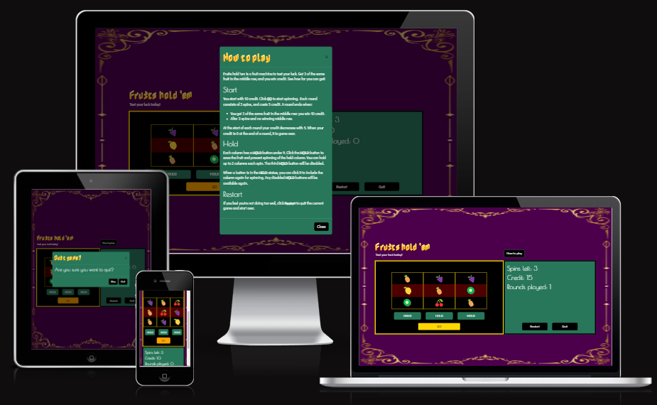
Generated by [Am I Responsive](https://ui.dev/amiresponsive).

## Index
- [Planning](#planning)
- [Features](#features)
- [Testing](#testing)
- [Technologies used](#technologies-used)
- [Deployment and development](#deployment-and-development)
- [Credits](#credits)

## Planning

### Site goals

The website aims to offer users a:
- fun and simple game to just enjoy and/or to quickly and easily test their luck,
- simple navigation on the game page, 
- responsive website across all screen sizes.

### User stories

#### As a gamer, I want to:

- easily navigate on the game page on any device, so that I get a user-friendly experience,
- find information on how the game works, so that I can play the game,
- be able to play the game,
- have the possibility to hold certain fruits, so that I can increase the chance of winning,
- keep track of how many spins I have left, so that I can adapt my tactic,
- keep track of my credit, so that I can follow my progress,
- keep track of how many rounds I have played, so that I can follow my progress or decide if I should stop or continue,
- be able to quit or restart the game, so that I have control over the game without needing to leave the website.

#### As a site owner, I want to offer visitors a:

- fun and addictive, user-friendly game, so that I can get a steady user base and gain traffic to my website.

#### Tasks to achieve user stories

Create a:
- **How to play** button that triggers information on how to play, which combinations make you win, and how the game ends,
- responsive slot machine-like box with:
  - three columns with fruits,
  - **HOLD** buttons under each column, with logic to:
    - hold a column so it does not spin when you click **GO**,
    - keep the held columns held each spin in the same round,
    - change to **HELD** and a different colour when clicked,
    - change back to **HOLD** and the original colour when clicked again,
    - not being able to hold three columns at once,
    - reset buttons at the start of a new round.
  - a **GO** button to start the game and spin the machine,
- section with: 
  - always visible information on how: 
    - much credit left,
    - many spins left,
    - many games played.
  - a button to restart,
  - a button to quit the game,
  - logic to:
    - increase the credit with a winning combination, 
    - decrease the credit at the start of a new round,
    - decrease spins left per round and reset it at the start of a round,
    - increase rounds played,
    - display a visual effect and an appropriate text when there is a winning combination.
- modal with information when:
  - the game ends due to insufficient credit, with the final number of rounds played and an option for the user to restart or quit,
  - you click **Quit**, with an appropriate text and option for the user to stay or confirm quit.
- suitable background image for the pages, to add to the overall positive experience,
- favicon.

### Design

#### Wireframes

Below are my initial wireframes per page for mobile, tablet, and laptop screen sizes. I used [Figma](https://www.figma.com/) to create them.

    
Start page (not used)
I decided to not have this separate start page as it just increases the amount of clicks and does not give any value, since the buttons can be on the game page.

  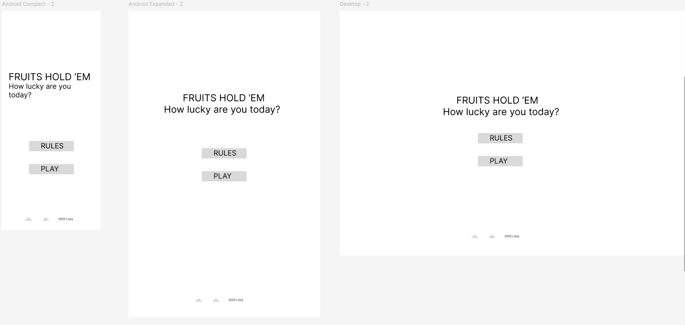

    
Game page
This is how I saw the page with the game itself. Later, I decided to not have a footer as it is not needed for an MVP.

  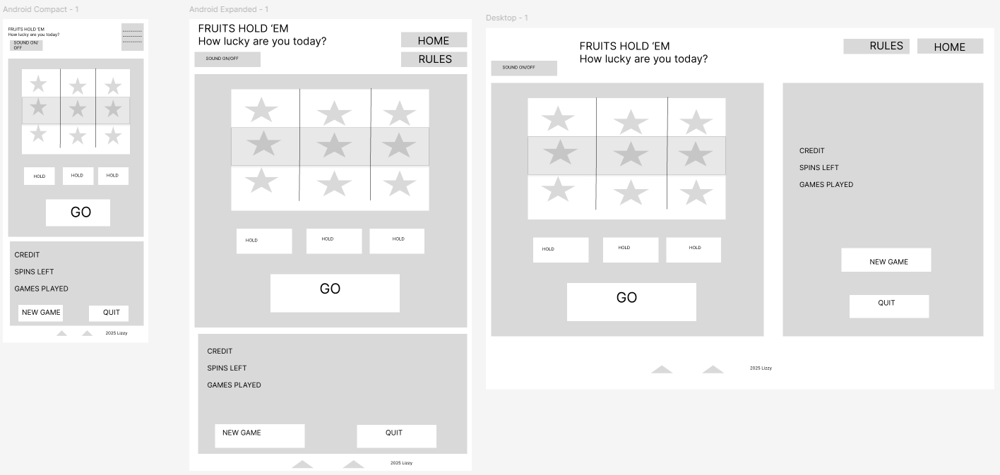

    
Page 404 not found

  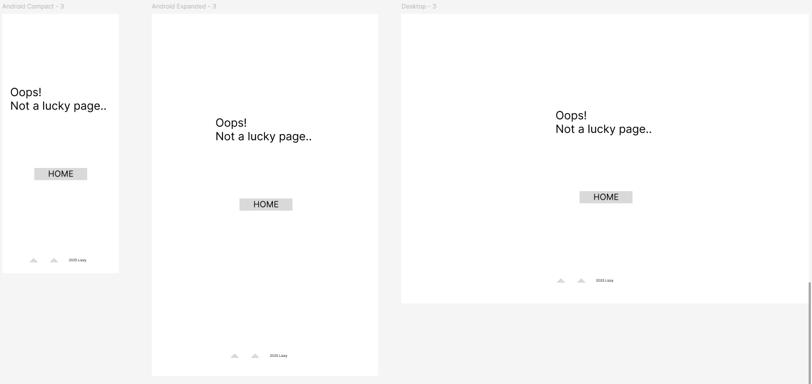

#### Color schemes

 A lot has been written about colours in casinos and slot machines in particular, and not all give the same reason for using particular colors. Basically, all websites I found say red is the main colour in casinos, because it symbolises excitement, and it attracts attention. Red in combination with gold represents success and winning, and gold of course symbolises luxury. I based my choices on i.e. [this article](https://www.newwavemagazine.com/single-post/the-psychology-of-color-in-casinos-how-design-choices-influence-the-player-s-mood), which says gold and red simulate a real-life casino feel in online games.
 
 
 Purple and black convey exclusiveness and class and I have seen a purple background a lot in images of slot machines, so I use this as well. 
 
 
 Several sources say orange is a much-used colour for spin/go buttons, so I use it for my **GO** button. 
 
 
 I use dark green as a background for credit info, to mimic the green tables in casinos. I also use this for my **HOLD** buttons. I use a darker variation of this green as well as a hover colour, based on how disabled **HOLD** buttons appear on the screen.

 
 As I went on, I used black more than I initially intended, for some buttons and the background for the fruits. I think it adds to the luxury feel of the website and works well with purple, green, and gold.

 
 This is my palette: https://coolors.co/4c004c-ff0000-ffd700-105837-28775b-000000-ffa500.

#### Fonts

Searching for fonts on [Google Fonts](https://fonts.google.com/), when I filtered on a *Calm* feeling, *Poiret One* really stood out to me. The calm feeling that I lack because I don't use blue in my colours (which the colour websites stated), can be compensated with this font. So I like it for my headings, but it is not good for informative texts. I found this article https://www.creatopy.com/blog/google-font-pairings/#21, and decided to pair it with *Didact Gothic* for my main body text.

When I filtered on a *Shaded* appearance and *Color* technology, I found *Nabla*, which I liked for my logo, because of the tilted look and the orange colour makes a good match with my fruity theme, although I could change the colour later of course. 

Because *Nabla* is not supported by Safari, I use *Passero One* for Safari, as it looks a bit like *Nabla*.

#### Logos and images

For my fruit images, I use HTML symbols. I chose fruits that look distinctive to enhance accessibility, and another advantage of HTML symbols is that it does not impact my performance as much as images would do. Later, I saw that my old computer displayed the symbols differently than my new computer. This would not be with images, but I think for the game functionality, performance is more important. The different symbols do not impact the game's functionality. I realise it is not good for consistency and for example marketing, that's why I did not reuse these symbols as images elsewhere on the website, like the favicon, because then it can get messy with different designs on the same page, for some devices. 

The background image is from [Canva](https://www.canva.com/). Originally a black background with gold decoration, I changed the background to purple and removed the outer frame of the decoration, but kept the curly decoration in the same colour as it was. I think the image enhances the luxury feeling I want to convey.

The favicon is an image of the **'em** in the logo in font *Nabla*. To create the favicon files, I used [RealFaviconGenerator](https://realfavicongenerator.net/).

The logo is the game name written in font *Nabla*, and in *Passero One* for the Safari browser.

## Features 

### Existing features

- __Header__

  - The header holds the logo, a motivating text, and the button **How to play**. 

 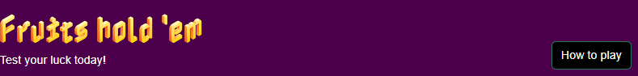

- __How to play modal__

  - When you click **How to play**, the corresponding modal opens with information on how to play the game. You can close this modal by clicking **Close** or **X** in the top right corner.

 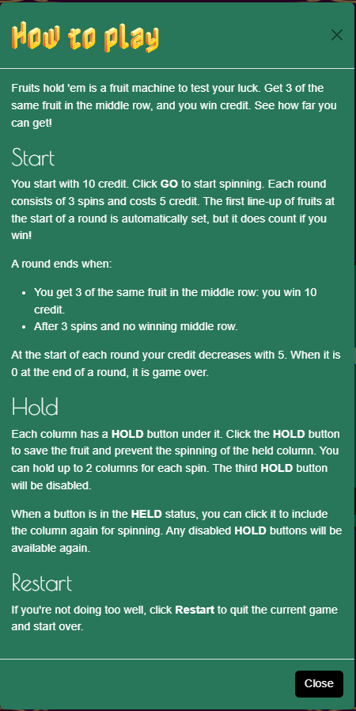

- __Game section__

  The game section holds three columns, a **HOLD** button under each column, and a **GO** button at the bottom. Here is where you play the game.

     __GO button__

     - You click **GO** to start the game so the columns get filled with fruits, and from there, you just click **GO** to 'spin' the columns each time. 
  
     __HOLD buttons__

     - You can click **HOLD** to prevent the column above it from spinning. The **HOLD** button changes from green to red with the button text **HELD**, and it changes back when you click it again. When you hold two columns, the third **HOLD** button becomes disabled so you can not hold three columns. If you enable one of the two **HELD** buttons again, the disabled button gets enabled again.

     - Your chosen held columns stay held between the spins, but the buttons get reset at the start of a new round.

     - With the **HOLD** buttons, you increase your chance of winning, for example, if you get two identical fruits in a spin, you can hold them so only the third fruit needs to be correct, giving you a 20% chance of a winning middle row.
  
     __Winning row__

     - When you have a winning middle row, the background for the row changes from red to green with a golden border, and a text appears above the columns with **WINNER!!**. Regardless of how many spins you have left, the round ends with a winning row. The round's final display of fruits displays for one second, and during this time, all **HOLD** buttons and the **GO** button become disabled, until the new round starts automatically with reset fruits.

     __No winning row__

     - When you have zero spins left and no winning combination, the round ends just like when you would have a winning combination; the final spin's fruits display for one second, during which **HOLD** and **GO** buttons are disabled, and a new round starts automatically after that.
     
  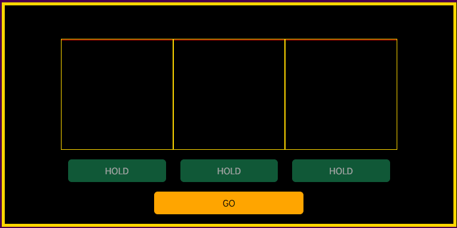

  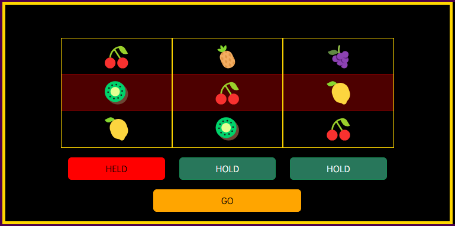

  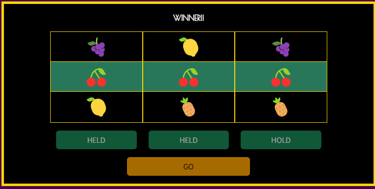

- __Credit info section__

  The credit info section holds the following information, so the user can keep track of how the game is going at all times:

    __Spins left__
    - The spin count counts down from 3 to 0 each round. A new round gives you 3 spins. At the start of a new round, new fruits are set and count right away if you win, without needing to spin. So effectively, you get four fruit spins, but you can not control the first one.

    __Credit__
    - You start the game with 10 credit. Apart from the first round, which is effectively free, at the start of each new round, credit decreases with 5. If you get a winning row, credit increases with 10 during the 1-second pause at the end of the round. This may look like credit only increases with 5, because a new round takes 5 credit at the start. When you have two winning combinations in a row, credit increases with 10 twice, but then takes 5 at the start of a new round. If this new round does not start with a winning combination, it looks like credit increases with 15.

    - When credit is 0 after the last spin of a round, the **Game over** modal pops up. Credit can not go negative.
  
    __Rounds played__
    - The number of rounds you played starts at 0 for your first round, and increases with 1 at the start of each new round. If you never get winning combinations, you can play 3 rounds. This is because the first round is effectively free, because you start with 10 credit in the first round, and it does not decrease until the start of the next round. 

  The section holds the following buttons:

   __Restart button__
     - The **Restart** button starts a new game right away with reset fruits and the credit info default values. It works the same as the first time you click **GO**.
   
   __Quit button__
     - The **Quit** button triggers the **Quit game** modal.

  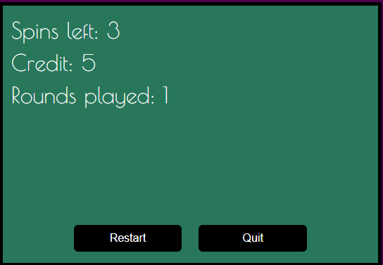

- __Game over modal__

   - The **Game over** modal informs you that you have no credit left for a new round. It informs you how many rounds you have managed to play. The more rounds, the luckier you have been, since everyone starts with the same credit and you can only gain credit by winning rounds. 
   
   - When you click **Play again**, a new game starts. When you click **Quit** or the **X** in the top right corner, you go back to the start page, before a game starts.
 
   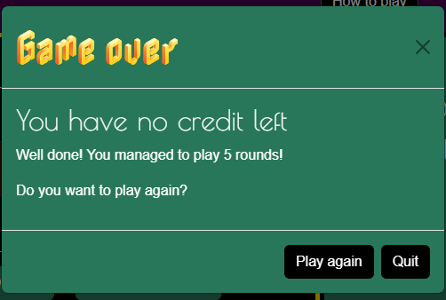

- __Quit game modal__

   - The **Quit game** modal opens when you click the **Quit** button, and asks you to confirm if you want to quit the game. You can click **Stay** or the **X** in the top right corner, to stay on the current game. You can click **Quit** to go back to the start page, to before a game starts.
   
   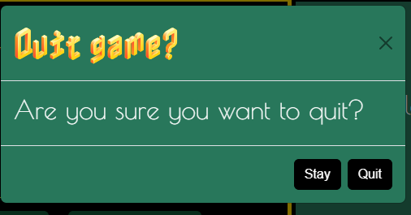

- __The 404 page__

  - The 404.html page consists of a simple text saying it is not a lucky page, and a **Play Fruits hold 'em** button that links to the home page.
  
  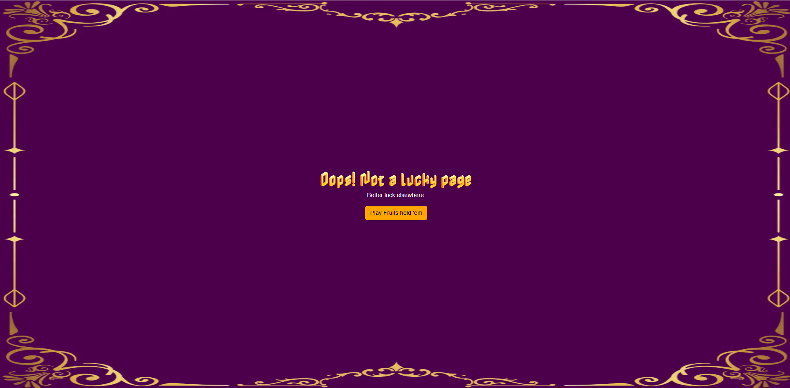

  Project file: 404.html

### Features left to implement

- Sound toggle with different sounds depending on a win or not.
- More exciting graphics when you have a winning row, like flashing effects.
- Different credit values for different fruits.
- Different winning lines.
- Spinning wheel effect in each spin before the fruits are settled.
- Social media links or links to an external website of the game makers.
- Shiny effects and bling overall in the game.

## Testing 

See [TESTING.md](TESTING.md).

## Technologies used

### Languages

- HTML
- CSS
- JavaScript

### Frameworks - libraries - programs used

- [Bootstrap](https://getbootstrap.com/) version 5.3
- [Figma](https://www.figma.com/) for wireframes
- Chrome DevTools for verifying responsibility and troubleshooting code
- [CodePen](https://codepen.io/pen/) for troubleshooting code
- [Gitpod](https://www.gitpod.io/) for coding
- [GitHub](https://github.com/) for version control and hosting
- [Google Fonts](https://fonts.google.com/) for my font pair
- [Canva](https://www.canva.com/) for background image
- Windows Paint for the cropping background image
- [TinyPNG](https://tinypng.com/) for compressing image size and converting to .webp
- Windows snipping tool for the favicon
- [RealFaviconGenerator](https://realfavicongenerator.net/) for creating favicon icons and the HTML code, and checking the favicon
- [Responsinator](http://www.responsinator.com/) for checking responsiveness
- [Autoprefixer](https://autoprefixer.github.io/) for adding the necessary prefixes to my CSS stylesheet
- [Am I Responsive](https://ui.dev/amiresponsive) for an image displaying the website on different screens

## Deployment and development

### Deployment
The site was deployed to GitHub pages. The steps to deploy are: 
  1. In the GitHub repository, navigate to the **Settings** tab,
  2. In the left menu, select **Pages**,
  3. Under **Source**, select **Deploy from a branch**,
  4. Under **Branch**, select **main**,
  5. Click **Save**, 
  6. In the GitHub repository, in the right menu, click **Deployments** to view the link to the deployed website.

The live link can be found here - https://lizzyongit.github.io/fruits-hold-em/index.html.

### Local development
To fork the repository:
  - In the GitHub repository, click the **Fork** button in the top right corner.

To clone the repository:
  1. In the GitHub repository, click the **Code** button.
  2. In the **Local** tab, select if you want to clone with HTTPS, SSH, or GitHub CLI, and copy the link below it.
  3. Open the terminal in your code editor and change the current working directory to the location you want to clone this repository to.
  4. Type *git clone* and paste the link from step 2, and press Enter.

## Credits 

### Content 

- All content is written by me.

### Media

- The original background image is on Canva, by 'hielmannuraddin's Team', called [Black and Gold Classic Background A4 Document](https://www.canva.com/sv_se/mallar/EAGICesfS6E-black-and-gold-classic-background-a4-document/). I edited this image in Canva.

### Resources

__Planning__
- For a font pairing idea, [this article](https://www.creatopy.com/blog/google-font-pairings/#21).
- To decide on which colours to use, I have researched several websites:
  - https://www.newwavemagazine.com/single-post/the-psychology-of-color-in-casinos-how-design-choices-influence-the-player-s-mood
  - https://colorfulconsole.com/the-art-of-slot-machine-design-using-colors-to-enhance-gameplay/ 
  - https://www.globalbrandsmagazine.com/color-schemes-popular-among-online-gambling-brands/ 
  - https://fashionisers.com/2020/06/22/color-psychology-in-online-casino-games-design/ 
  - https://hickmandesign.co.uk/blog/other/psychology-of-casino-game-design/?srsltid=AfmBOoqN_NQjVzYCdMEXdxkKP7hirVuOcc1yR1pRNuj2DlTwndNwtmi- 
  - https://www.globalbrandsmagazine.com/casino-colors-psychology-lucky-gambling-colors/
  - https://www.myperfectcolor.com/paint/101581-true-value-3496-casino-green#:~:text=The%20RGB%20values%20for%20True,light%20that%20a%20color%20reflects
- For getting a colour scheme and checking the color contrast, [Coolors.co](https://coolors.co).

__During development and testing__
- Bootstrap documentation [Bootstrap](https://getbootstrap.com/docs/5.3/getting-started/introduction/).
- [W3schools](https://www.w3schools.com/) for getting the fruit icons and reading up on concepts.
- [MDN Web Docs](https://developer.mozilla.org/en-US/) to read up on concepts.
- [Stackoverflow](https://stackoverflow.com/) for general code questions.
- Inspiration and code bits from CI walkthrough project *Simon says*.
- How to redirect to another page with JavaScript: [tutorialspoint](https://www.tutorialspoint.com/how-to-redirect-to-another-webpage-using-javascript).
- How to open a Bootstrap modal with JavaScript: [Stackoverflow](https://stackoverflow.com/questions/62101647/.javascript-bootstrap-open-bootstrap-modal-with-javascript-and-not-with-button).
- To set focus on an element: [Laracasts](https://laracasts.com/index.php/discuss/channels/vue/how-to-focus-on-an-input-after-disabling).
- Troubleshoot *aria-hidden* error: 
 - https://github.com/WordPress/gutenberg/issues/56547, 
 - https://github.com/twbs/bootstrap/issues/41005, 
 - https://stackoverflow.com/questions/62677291/aria-hidden-elements-do-not-contain-focusable-elements-issue-when-modal-is-sho.
- Troubleshoot missing *focus-outline* on buttons: https://github.com/twbs/bootstrap/issues/38903.
- To understand background-size setting: [Cloudinary](https://cloudinary.com/guides/front-end-development/6-ways-to-stretch-a-background-image-with-css).
- Slack post on a console error I got as well: https://code-institute-room.slack.com/archives/D07L9QW7YS3/p1738070720220649.
- How to target Safari with CSS: [Wojtek Witkowski](https://wojtek.im/journal/targeting-safari-with-css-media-query). 

__Project finalisation__ 
- [Grammarly](https://www.grammarly.com/grammar-check) spellchecker.
- [Diffchecker](https://www.diffchecker.com/text-compare/) for checking Autoprefixer changes.
- Other students' readme files for learning about local development processes.

### Acknowledgments
- My mentor Jubril for the feedback.
- My cohort facilitator Kay for the pep talks.