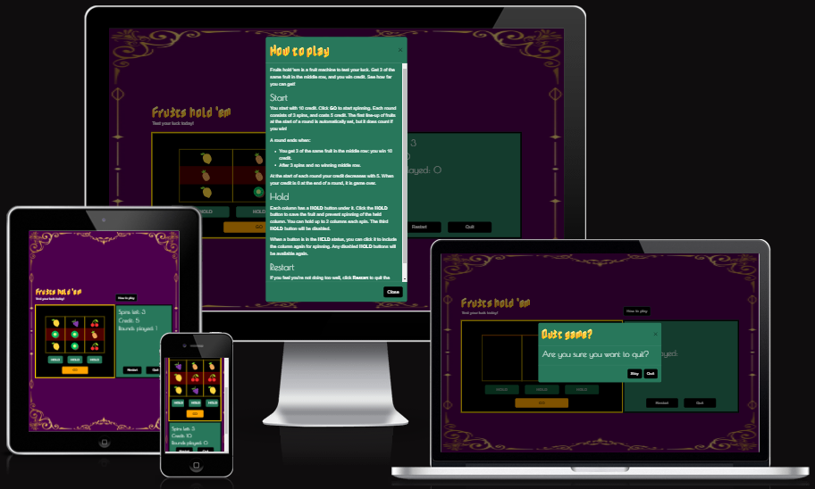

# Fruits hold 'em

[Live link to website](https://lizzyongit.github.io/sotis-lifecoach/index.html)

**Fruits hold 'em** is a slot machine game purely based on luck, for gamers and people who want to see how lucky they are today, or just enjoy playing this kind of games, without losing money.

Click **GO** and the fruit images will line up randomly each spin. You get three spins in one round to try to get a winning middle row with three of the same fruits. You can hold up to two fruits so that you can increase your chance to win. If you win a round, you earn credit. You can keep track of your credit, how many spins you have left the current round, and how many rounds you have played. You can play until your credit is finished, or when you click one of the buttons **Restart** or **Quit**. The button **How to play** triggers a dialog box with the rules of the game.

## Index
- [Planning](#planning)
- [Features](#features)
- [Testing](#testing)
- [Technologies used](#technologies-used)
- [Deployment](#deployment)
- [Credits](#credits)

## Planning

### Site goals

The website aims to offer users a:
- fun and simple game to just enjoy and/or to quickly and easily test their luck, 
- responsive website across all screen sizes,
<!-- - user-friendly, simple navigation across the website. -->

### User stories

#### As a gamer, I want to:

<!--- be able to navigate to all pages on any device and experience a user-friendly website,-->
- find information on how the game works, so that I can play the game,
- have the possibilty to hold certain fruits, so that I can increase the chance of winning,
- keep track of how many spins I have left, so that I can adapt my tactic,
- keep track of my credit, so that I can follow my progress,
- keep track of how many rounds I have played, so that I can follow my progress or decide if I should stop or continue,
<!-- - turn on or off the sound, so that I can decide which I prefer more,-->
- be able to quit or restart the game, so I have control over the game without needing to leave the website,
<!-- - find links to social media, so that I can find out more about the game and find other games by the same makers.-->

#### As a site owner, I want to offer visitors a:

- fun and addictive game, so that I can get a steady user base and gain traffic to my website,
<!-- - way to easily find me on social media, so that I can gain followers there.-->

#### Tasks to achieve user stories

Create a:
- home page with a button to play,
- **How to play** button with information on how to play, which combinations make you win, and how the game ends,
- responsive slot machine like box with:
  - three columns with fruits,
  - logic to :
    - increase the credit with a winning combination, 
    - decrease the credit at start of a new round,
    - decrease spins left per round and reset it at start of a round,
    - increase rounds played,
    - display visual effect when there is a winning combination.
  - **HOLD** buttons under each column, with logic to:
    - hold a column so it does not spin when you click **GO**,
    - keep the held columns held each spin in the same round,
    - change to **HELD** when clicked,
    - change back to **HOLD** when clicked again,
    - not being able to hold three columns at once,
    - reset when there is a winning combination or at the end of the game.
  - a **Go** button to spin the machine,
  - always visible information on how: 
    - much credit left,
    - many spins left,
    - many games played.
- button to restart,
- button to quit the game,
- modal with information when:
  - the game ends due to insufficient credit, with an appropriate text,
  - you click **Quit**, with an appropriate text.
- suiting background image for the pages,
- favicon (adds to user-friendly website experience).

### Design

#### Wireframes

Below are my initial wireframes per page for mobile, tablet and laptop screen sizes. I used [Figma](https://www.figma.com/) to create them.

    
Start page (not used)

    I decided to not have this separate start page as it just increases the amount of clicks and does not give any value, since the buttons can be on the game page.

  

    
Game page

    This is how I saw the page with the game itself.

  

    
Page 404 not found

  

#### Color schemes

 A lot has been written about colours in casino's and slot machines in particular, and not all give the same reason for using particular colors. Basically all websites I found say red is the main colour in casino's, because it symbolises excitement, and it attracts attention. Red in combination with gold represents success and winning, and gold ofcourse symbolises luxury. I based my choices on [this article](https://www.newwavemagazine.com/single-post/the-psychology-of-color-in-casinos-how-design-choices-influence-the-player-s-mood), which says gold and red simulates a real life casino feel in online games.
 
 
 Purple and black convey exclusiveness and class and I have seen a purple background a lot in images of slot machines, so I use this as well. 
 
 
 Several sources say orange is a much used colour for spin/go buttons, so I use it for my **GO** button. 
 
 
 I use dark green as a background for credit info, to mimic the green tables in casinos. I also use this for my **HOLD** buttons. I use a darker variation of this green as well as a hover colour, based on how disabled **HOLD** buttons appear on the screen.

 
 As I went on, I used black more than I initially intended, for some buttons and the background for the fruits. I think it adds to the luxury feel of the website and works well with purple, green and gold.

 I would like to add some extra shiny effects or bling in my game, if it is possible. To match a more flashy casino style machine.

 
 This is my pallete: https://coolors.co/4c004c-ff0000-ffd700-105837-28775b-000000-ffa500.

 These are my sources:

 https://colorfulconsole.com/the-art-of-slot-machine-design-using-colors-to-enhance-gameplay/
https://www.globalbrandsmagazine.com/color-schemes-popular-among-online-gambling-brands/
https://fashionisers.com/2020/06/22/color-psychology-in-online-casino-games-design/
https://hickmandesign.co.uk/blog/other/psychology-of-casino-game-design/?srsltid=AfmBOoqN_NQjVzYCdMEXdxkKP7hirVuOcc1yR1pRNuj2DlTwndNwtmi-
https://www.globalbrandsmagazine.com/casino-colors-psychology-lucky-gambling-colors/

https://www.myperfectcolor.com/paint/101581-true-value-3496-casino-green#:~:text=The%20RGB%20values%20for%20True,light%20that%20a%20color%20reflects.

#### Fonts

Searching for fonts on [Google Fonts](https://fonts.google.com/), when I filtered on a *Calm* feeling, *Poiret One* really stood out to me. The calm feeling that I lack because I don't use blue in my colours (which the colour websites stated), can be compensated with this font. So I like it for my headings, but it is not good for informative texts. I found this article https://www.creatopy.com/blog/google-font-pairings/#21, and decided to pair it with *Didact Gothic* for my main body text.

When I filtered on a *Shaded* appearance and *Color* technology, I found *Nabla*, which I liked for my logo, because of the tilted look and the orange colour makes a good match with my fruity theme, although I could change the colour later ofcourse. 

#### Logos and images

For my fruit images, I use HTML symbols. I chose fruits that look distinctive to enhance accessibility, and another advantage of HTML symbols, is that it does not impact my performance as much as images would do. Later, I saw that my old computer displays the symbols differently than my new computer. This would not be with images, but I think for the game functionality, performance is more important. The different symbols do not impact the game functionality. I realise it is not good for consistency and for example marketing, that's why I did not reuse these symbols as images elsewhere on the website, like the favicon, because than it can get messy with different designs on the same page, for some devices. 

The background image is from [Canva](https://www.canva.com/). Originally a black background with gold decoration, I changed the background to purple and removed the outer fram of the decoration, but kept the curly decoration and in the same colour as it was. I think the image enhances the luxury feeling I want to convey.

The favicon is an image of the **'em** in the logo. To create the favicon files, I used [RealFaviconGenerator](https://realfavicongenerator.net/).

The logo is the game name written in font *Nabla*.

## Features 

### Existing features

- __Header__

  - The header holds the logo, a motivating text and the button **How to play**. 

- __How to play modal__

  - When you click **How to play**, the corresponding modal opens with information on how to play the game. You can close this modal by clicking **Close** or **X** in the top right corner.

- __Game section__

  The game section holds three columns, a **HOLD** button under each column, and a **GO** button at the bottom. Here is where you play the game.

     __GO button__

     - You click **GO** to start the game so the columns get filled with fruits, and from there, you just click **GO** to 'spin' the columns each time. 
  
     __HOLD buttons__

     - You can click **HOLD** to prevent the column above it to spin. The **HOLD** button changes from green to red with the button text **HELD**, and it changes back when you click it again. When you hold two columns, the third **HOLD** button becomes disabled so you can not hold three columns. If you enable one of the two **HELD** buttons again, the disabled button gets enabled again.

     - Your chosen held columns stay held between the spins, but the buttons get reset at the start of a new round.
  
     __Winning row__

     - When you have a winning middle row, the background for the row changes from red to green with a golden border, and a text appears above the columns with **WINNER!!**. Regardless of how many spins you have left, the round ends with a winning row. The round's final display of fruits displays for one second, and during this time, all **HOLD** buttons and the **GO** button become disabled, until the new round starts automatically with reset fruits.

     __No winning row__

     - When you have zero spins left and no winning combination, the round ends just like when you would have a winning combination; the final spin's fruits display for one second, during which **HOLD** and **GO** buttons are disabled, and a new round starts automatically after that.

- __Credit info section__

  The credit info section holds the following:

  __Spins left__
  - The spin count counts down from 3 to 0 each round. A new round gives you 3 spins. At the start of a new round, new fruits are set and count right away if you win, without needing to spin. So effectively, you get four fruit spins, but you can not control the first one.

  __Credit__
  - You start the game with 10 credit. Apart from the first round, which is effectively free, at the start of each new round, credit decreases with 5. If you get a winning row, credit increases with 10 during the 1 second pause at the end of the round. This may look like credit only increases with 5, because a new round takes 5 credit at the start. When you have two winning combinations in a row, credit increases with 10 twice, but then takes 5 at the start of a new round, if this round does not start with a winning combination, so it looks like credit increases with 15.

  - When credit is 0 after the last spin of a round, the **Game over** modal pops up. Credit can not go negative.
  
  __Game over modal__
  - The **Game over** modal informs you that you have no credit left for a new round. It informs you how many rounds you have managed to play. When you click **Play again**, a new game starts. When you click **Quit** r the **X** in the top right corner, you go back to the start page, before a game starts.

  __Rounds played__
  - The number of rounds you played starts at 0 for your first round, and increases with 1 at the start of each new round. If you never get winning combinations, you can play 3 rounds. This is because the first round is effectively free, because you start with 10 credit the first round, and it does not decrease until the start of the next round. 

  __Restart button__
  - The **Restart** button starts a new game right away with reset fruits and the credit info default values. It works the same as the first time you click **GO**.

  __Quit button and Quit game modal__
   - The **Quit** button triggers the **Quit game** modal and asks you to confirm if you want to quit the game. You can click **Stay** or the **X** in the top right corner, to stay on the current game. You can click **Quit** to go back to the start page, before a game starts.

- __The 404 page__

  - The 404.html page consists of a simple text explaining the page is not found, and a **Play Fruits hold 'em** button that links to the home page.

  Project file: 404.html

### Features left to implement

- Sound toggle with different sounds depending on a win or not.
- More exciting graphics when you have a winning row, like flashing effects.
- Different credit values for different fruits.
- Different winning lines.

## Testing 

See [TESTNG.md](TESTING.md).

### User story testing

|   User story                                                            | How it is achieved    |
|  -----------                                                             | -----------           |
|**As any user of this website, I want to:**|
|be able to navigate to all pages on any device and experience a user-friendly website|Fixed navigation bar that is always visible, responsiveness of all pages.|
|**As a person interested in seeing a life coach, I want to:**|
|find information about Sotis the life coach and how he works, so that I can decide if I consider booking an appointment with him.  |**About** and **Philosophy** sections, pictures, social media links.            |
|**As a potential client, I want to:**      |
|find information about what Sotis can offer me, how much it would cost and where it would be, so that I can decide if I want to book an appointment with him.   | **What I offer** page with all the offered sessions, address in the footer.        |
|be able to contact Sotis, so that I can ask questions about anything unclear, so that I can decide if I still want to book an appointment with him.| Contact information in the footer.        |
|read reviews from previous clients, to decide if I also want to book an appointment with Sotis.| **Testimonials** section. |
|find a way to book an appointment, so that I can do this easily on the website.| **Book** page with booking form, reached via **Book now** buttons on **What I offer** page and **Book** button in the navigation bar. |
|**As a confirmed client, I want to:**     |
find contact information, so that I can contact Sotis about any matter regarding my appointment.  | Contact information in the footer.        |
|**As a site owner, I want to:**    |
get word around about a special cat offering life coach services, so that I build brand awareness.  | The **About** and **Philosophy** sections, images, the inspiring quote, page **What I offer**, social media links.        |
 get visitors to book an appointment, so that I grow my business and help clients.| The **About**, **Philosophy** and **Testimonials** sections, images, and **What I offer** page should convince the visitors, while the buttons that link to the **Book** page, and the **Book** page form should get the visitors to actually book.      |

### Issues

I want to mention a few issues here because they were not straightforward to fix.

#### Testimonials carousel
The biggest issue I faced was the text-based **Testimonials** carousel, it needed a lot of customised styles.

- To have the controls not overlap the text, I had to give the carousel slide a certain padding which also had to be adapted for different screens with media queries, because for smaller screens, too much padding caused a lot of empty space and cramped text.

- Because the testimonial texts are not equally long, the blue background carousel slides had different heights for different testimonials, which I fixed with media queries with a min-height value. 

- The texts were in the top of the slide, which did not look good. I needed to get it vertically in the middle. 

  Css *vertical-align* did not work, I tried to add new divs with *.container*, *.row* and *.col* and use *align-items-center* or *align-self-center*, but this made the carousel not work good.

  Playing around in DevTools, *display:inline-flex* worked on some element, but since I did not understand what it actually did, I did not go with that. 

  Targeting all the carousel items with the *carousel-item* class and css *display:flex* and *align-items:center*, made the carousel look disturbed and not work. 

  Targeting the *container-item* class with the *active* class and custom css *display:flex* and *align-items:center*, finally worked to get the text in the middle each slide. I realised in DevTools, that when the carousel runs, the slide that is there, gets the *active* class. But it makes it hard to troubleshoot since it changes so quickly. Targeting only the carousel item with the *active* class may override some other setting since it's more specific than just targeting *.carousel-item*, so I guess this is why it worked.

- The next issue was that in between two carousel items, before the upcoming carousel item displays correctly in the middle on the blue background, there was a white background where the upcoming text was displayed in the top. To fix the background color to remain blue all the time, I added the background to the wrapper div element. 

- But the text still displayed in the top of the slide in between two slides, so there was a little 'jump' every time in between two slides, from the top to the middle. 

  I tried some different styles of 'sliding', like 'fade', but it did not work. 

  My thought was that I should make the upcoming slide look like the active slide, so I applied the same styles to the *.carousel-inner* div to get it to look like the active carousel-item, which made it look better since the upcoming text was not in the top anymore, but in the middle. 

- But there was still another kind of jump; since the padding seemed to be different between the slides, the upcoming text was wider than the text on the active slide, so the sides 'jumped' inwards. 

  I tried to target the actual *carousel.item* class with some of the same styles as the active carousel item, but that did not look better, it went up and down again or all testimonials were on top of each other. So the little jump seemed better at that time.

  However, I could not let this go and tried to fix this again later. DevTools helped me enormously with the carousel. Initially, I could not figure out the issue but as the slides went on and I was looking at what happened in the DevTools side panel, I suddenly noticed a class *.carousel-item-next*, and figured this must be the 'upcoming' slide. I tested giving that the same padding as the active slide, which resulted in the text being the same width, since both the upcoming slide and the active slide had the same padding. 

  But, then the text was not vertically in the middle, so it needed to have *display:flex* and *align-items:center* as well, so it would be exactly the same as the *active* class. 

  I realised then that when you control the carousel yourself, and go to the previous slide manually, the previous slide ofcourse still has the 'jump' and previous issues, so I found *.carousel-item-prev* in DevTools and targeted that class with the same styles as *.coursel-item-next*, which finally made the carousel work smoothly without 'jumps'.

#### Anchor links on fixed navigation bar

- The fixed navigation bar was overriding the headers after you clicked on the anchor links **About**, **Philosophy** and **Testimonials**. However, the solution provided in the *Boardwalk games* project did not work for me, since I have not used so much margin or padding between my sections as in the *Boardwalk games*, so there would be no place for the navigation bar anyway. The navigation bar would simply need to overlap content. I did not want to add spaces just because of this navigation bar and decided to look for a solution. 

  I googled and found [this article](https://css-tricks.com/fixed-headers-on-page-links-and-overlapping-content-oh-my/) with the suggestion of a simple style rule for the html element: *scroll-padding-top: 70px; /* height of sticky header */*. I checked if this *scroll-padding-top* is supported by all browsers, and found that it was [on this page](https://developer.mozilla.org/en-US/docs/Web/CSS/scroll-padding-top). I applied it with my navigation bar's height of 56px, and it worked.

- Another issue I needed to fix was that of the navigation bar not closing after clicking an anchor link, as is done in the *Boardwalk games* project as well. The javascript code provided there, interfered with my *scroll-padding-top* solution, so I needed to find another solution for closing the navigation bar after clicking an anchor link. 

  For this, I used a posted bug report on CI's Slack from October 16-22 2024. James_BC provides an html code to make the anchor links close after clicking. This html code did not work but I quickly found that this was because the id was not correct, so I adapted the code and it worked. 

  James_BC also provided a css code that would fix an issue on larger screens, as the navigation bar menu titles seem to collapse and open again when clicking on an anchor link. I copied this code in my css stylesheet under media queries, and it worked.

- However, I noticed that the navigation bar did not close when you click next to an anchor link text, even if it navigates to the link. My mentor Antonio Rodriguez found a fix for that during a mentor session, he provided a css style making the span element inside the anchor link display as a full width block, and therefore, when you click next the the link title, the navigation bar closes and navigates to the link. 

- But I saw later that when you click a bit under an anchor link title, the navigation bar will not close even if it navigates correctly. In DevTools, I saw this had to do with a padding that is missing on the span, so the span's height was not the same as the anchor link. To fix this, I decided to give those wrapping anchor link elements a new class, and target them to not have a padding, and put the padding on the span element inside them instead. This way, all the menu items have the same space between, and you can click a bit under or above an anchor link title, and still go to the correct section while the navigation bar closes.

- A small issue left is that the navigation bar is not closing quickly, it seems to roll up as the page navigates to the correct section, but I think this is acceptable.

### Validator testing 

- Html
  - The [W3C validator](https://validator.w3.org) notified me along the way about trailing slashes, since I had used 'br /', a missing p tag because I had put an ol tag inside a p tag, which is not allowed. It also notified me about a section without a header, the section I wrapped around the *About* and *Philosophy* sections and the image in between. This section does not need a separate title, so I gave it an h2 with a *visually-hidden* class.

  - No warnings or errors are currently found when passing through the validator:
    -  [index.html](https://validator.w3.org/nu/?showsource=yes&doc=https%3A%2F%2Flizzyongit.github.io%2Fsotis-lifecoach%2Findex.html)

    -  [what-i-offer.html](https://validator.w3.org/nu/?showsource=yes&doc=https%3A%2F%2Flizzyongit.github.io%2Fsotis-lifecoach%2Fwhat-i-offer.html)

    -  [book.html](https://validator.w3.org/nu/?showsource=yes&doc=https%3A%2F%2Flizzyongit.github.io%2Fsotis-lifecoach%2Fbook.html)

    -  [404.html](https://validator.w3.org/nu/?showsource=yes&doc=https%3A%2F%2Flizzyongit.github.io%2Fsotis-lifecoach%2F404.html)

- Css
  - The [(Jigsaw) validator](https://jigsaw.w3.org/css-validator) notified me along the way about an invalid value of padding, which I missed. This was easily fixed.

  - No errors are currently found when passing through the validator:

  

  - The warnings given by the validator apply to the imported Google fonts, variables and the autoprefixer additions. These are the same as the warnings for the *Boardwalk Games* project, and they can be ignored, as they were ignored there.

  

### Lighthouse testing

#### Index.html

Running the home page in Lighthouse resulted in 100% for accessability and best practices, but 79% for performance:

(Later, I realised I did not include index.html in the url, so this may have caused the low score.)

An issue was to 'serve images in next-gen formats', suggesting to fix the hero image and my rounded image. I converted those to .webp images.

It also said to 'properly size images', and suggested to fix my logo and the image of Sotis at work. I made my logo and image files smaller, but still made sure the uploaded images would always be larger than they actually will be displayed, as I don't want the risk of the images getting enlarged and losing quality.

After this, performance improved to 92%, but the score does change from time to time, as my computer is also a bit slow.

Looking at what more I could do, it said to 'minimize main-thread work', mentioning style and lay-out. My css is not very complicated, but I changed some of my css targets to include child combinators instead of descendent combinators, as they should be faster. However, I did not make all of my targets specific, as this would make it harder to read I think, and it is not done in the walkthrough projects either. Now the result is 93%:

After redoing the html with h1 tags, see more below for what-i-offer.html, I got a much better result, but this was taken after I cleaned up my computer a bit, so it could just be my computer's performance influencing this. The red bullets in the Lighthouse report now have to do with Bootstrap, JS, Google fonts, all issues I cannot fix. 

#### what-i-offer.html

Before running Lighthouse, I converted all my images to .webp files. The first result was:

Regarding accessibility on 98%, there was an issue 'Heading elements are not in a sequentially-descending order'. This is because the card titles from Bootstrap have the h5, while the descending order would be h3. I changed all these card titles to h3 with a class of h5 to have the same font size. Because of my custom css for h3, the font changed to *Montserrat Alternates*, which I kept.

Running Lighthouse again, resulted in 100% for accessibility, and now suddenly performance got to 95% as well.

After this, I actually went through the use of my headings on all pages, since an h1 was missing on every page. After adding h1 and redoing the html structure a bit, I run the html and css validators again and updated the results. I also got a new better result for Lighthouse on the home page, which may have to do that I took this one after my computer was cleaned up a bit.

The red bullets in the Lighthouse report now have to do with Bootstrap, JS, Google fonts, all issues I cannot fix. Sometimes, it says my image for the *Talking* session is too large, but it is already converted.

#### book.html

The first run Lighthouse report gives 98% on performance and 100% on accessibility and best practices. 

The red bullets, like for the other pages, mention CCS, JS which is related to Bootstrap, and Google fonts. It mentions to 'minimize main-thread work' again, 'Other' being the highest, but I don't see how I can fix this and I'm happy with the score.

#### 404.html

The first Lighthouse report gives 98% on performance and 100% on accessibility and best practices.

I'm happy with this score for performance, and like the other pages it mentions Bootstrap, Google fonts, and I don't see anything I can improve.

### Manual testing

#### Form testing

I tested the form on the book.html page and you can not send the form if not all fields are filled out. Each time you try to click **Send**, it will give a warning message on the first field that is not filled out, and after you fill that one out and click **Send** again, it will show the message on the next field, and so on. 

For the email field, it requires an @ and a '.com' and something before @ and in between, 'a@a.com' works. 

The phone number field requires a number (however, it does let you type an 'e', but will still give an error).

The selectable option fields all show the correct options and you actively have to select one to continue.

All other fields are texts. 

After sending a completed form, you go to the CI formdump where you can see that the input names and values are correct.

#### Link testing

All links in the navigation bar go to the correct pages or sections. All buttons go to the correct page. The social media links in the footer go to the correct pages and open in a new tab.

#### Browser testing

I tested my website on Chrome, Edge and Firefox. For testing Safari, I used Chrome UA Spoofer.

I found one minor difference:

On Firefox, regarding the **Phone** field in the form on book.html, you can type any letter, but you will get an error message saying you have to fill in a number. In other browsers, you can not even type anything else than a number (except for an 'e', but it will still give you an error). I find this acceptable.

#### Device testing

I checked the website in DevTools for the different dimensions. A few of my features have very different lay-outs on different screens, working as intended:
- Navigation bar: from small mobile screens to and including tablet screens, the menu links are collapsed in a hamburger menu.
- Hero image: from small mobile screens to but not including tablet screens, the header and quote move from the left center of the image, to the bottom of the image, to not overlap Sotis' head.
- **About**, image and **Philosophy**: from small mobile screens to but not including tablet screens, these sections are stacked vertically and take up the full screen width, with the headers centered. From tablet screens and up, they take up one row with three equal-width columns, and the headers are left aligned.
- **Testimonials**: from small mobile screens up to and including 991 px width, the carousel takes the full width of the screen, from 992 px, it takes half the width of the container, but is centered in the middle of the screen.
- Footer: from small mobile screens to but not including tablet screens, the address section and email and phone section are stacked vertically and aligned to the left. From tablet-size screens, these two sections are displayed next to each other in two columns, where the address section in the left column is moved to the end/right of its own column.
- **What I offer** page: 
  - from small mobile screens to but not including tablet screens, the four cards are stacked vertically, each at full width of the screen,
  - from tablet screen size to but not including small laptops at 992 px width, the four cards are displayed in two rows of two cards,
  - from 992 px, the cards are displayed in one row of four cards.
- **Book** page: 
  - from small mobile screens to but not including tablet screens, the form fields are vertically stacked at full width of the screen,
  - from tablet screen size and up, the form fields are displayed in two columns next to each other.

I also checked the different web pages in [Responsinator](http://www.responsinator.com/). I found a missing margin there for 404.html when you turn a device horizontally. I realise I did not see this before because the section is so small, the viewport was always much larger, creating the white space around it when I centered the section with the *.my-auto* class. But turning the device creates a much smaller viewport, so the *.my-auto* did not create any margin around the section, and it does not look good:

I simple added *.my-3* to the inner div.row to create some margin, without interfering with anything else. It looks fine now:

This change did not cause any new issue in the html validator or the Lighthouse report for this page.

I also tested on my own Huawei smartphone.

#### Favicon testing

When I ran my website in Realfavicongenerator's [favicon checker](https://realfavicongenerator.net/checker), I got several errors, it seemed like I was missing some files that Favicon.io, that I used initially, did not generate. So I decided to replace my favicons with the ones generated by Realfavicongenerator and get a new html code. I also removed my favicon folder and moved the files to the root folder, as I read on several websites that this is recommended.

After checking my website in the favicon checker again, there were two errors left regarding the web app manifest, saying the 192x192 and 512x512 icons could not be found. I could not fix this issue, so I decided to remove the web app manifest file and images. These icons are for when a website can be installed as an app, which is not relevant at this point.

### Fixed bugs

See [Issues](#issues).

### Unfixed Bugs

None.

## Technologies used

### Languages

- HTML 5
- CSS 3

### Frameworks - libraries - programs used

- [Bootstrap](https://getbootstrap.com/) version 5.3
- [Figma](https://www.figma.com/) for wireframes
- Chrome DevTools for verifying responsibility and troubleshooting code
- [Gitpod](https://www.gitpod.io/) for coding
- [GitHub](https://github.com/) for version control and hosting
- [Google Fonts](https://fonts.google.com/) for my font pair
- [Fontawesome](https://fontawesome.com/) for my icons
- [TinyPNG](https://tinypng.com/) for compressing image size and converting to webp
- Windows Paint for resizing and cropping images
- Windows Photos for resizing images
- [Responsinator](http://www.responsinator.com/) for checking responsiveness
- [Canva](https://www.canva.com/) for logo
- [Lunapic](https://www3.lunapic.com/editor/) for transparent background and coloring in logo
- [RealFaviconGenerator](https://realfavicongenerator.net/) for creating favicon icons and the html code, and checking the favicon
- [Autoprefixer](https://autoprefixer.github.io/) for adding the necessary prefixes to my css stylesheet
- [Chrome UA Spoofer](https://chromewebstore.google.com/detail/user-agent-switcher-for-c/djflhoibgkdhkhhcedjiklpkjnoahfmg) to test my website on Safari

## Deployment

- The site was deployed to GitHub pages. The steps to deploy are: 
  - In the GitHub repository, navigate to the **Settings** tab,
  - In the left menu, select **Pages**,
  - Under **Source**, select **Deploy from a branch**
  - Under **Branch**, select **main**,
  - Click **Save**, 
  - In the GitHub repository, in the right menu, click **Deployments** to view the link to the deployed website.

The live link can be found here - https://lizzyongit.github.io/sotis-lifecoach/index.html.

## Credits 

### Content 

- The quote on the hero image was taken from [Sandjest](https://sandjest.com/blogs/quotes/cat-quotes).
- All other text was written by me.
- The icons in the footer were taken from [Font Awesome](https://fontawesome.com/).

### Media

- All images are my own.

### Resources

- Redirect to other page [tutorialspoint](https://www.tutorialspoint.com/how-to-redirect-to-another-webpage-using-javascript).

- Bootstrap documentation [Bootstrap](https://getbootstrap.com/docs/5.3/getting-started/introduction/).
- [W3schools](https://www.w3schools.com/) for looking up semantic html.
- [Stackoverflow](https://stackoverflow.com/) for general code questions.
- For font pairing idea, [this blog from Approval studio](https://approval.studio/blog/how-to-combine-fonts/).
- Inspiration from CI walkthrough projects *Boardwalk Games*, *Mei Wong portfolio* and *Love running*.
- Inspiration from [this website template](https://themewagon.github.io/Pilates/).
- For getting a color scheme and checking the color contrast, [Coolors.co](https://coolors.co).
- [Grammarly](https://www.grammarly.com/grammar-check) spellchecker.
- [Diffchecker](https://www.diffchecker.com/text-compare/) for checking autoprefixer changes.
- Fixing the navigation bar to not overlap internal links, [this article from Css-tricks](https://css-tricks.com/fixed-headers-on-page-links-and-overlapping-content-oh-my/).
- Checking browser compatibility of a css style rule, [this page from MDN](https://developer.mozilla.org/en-US/docs/Web/CSS/scroll-padding-top).
- CI bug report Slack channel, post from James_BC on 16-22 Oct 2024, for the html and css code for fixing the navigation bar to close after clicking anchor links, with a minor adjustment from me.
- Checking what I can do to improve performance, [Chrome DevTools documentation](https://developer.chrome.com/docs/lighthouse/performance/mainthread-work-breakdown/?utm_source=lighthouse&utm_medium=devtools).
- [Markdown guide](https://www.markdownguide.org/) for markdown syntax.

## Acknowledgments
- My mentor Antonio Rodriguez for tips, feedback, and fixing a bug.